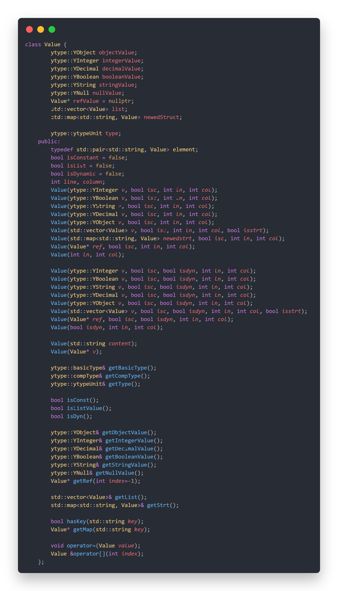
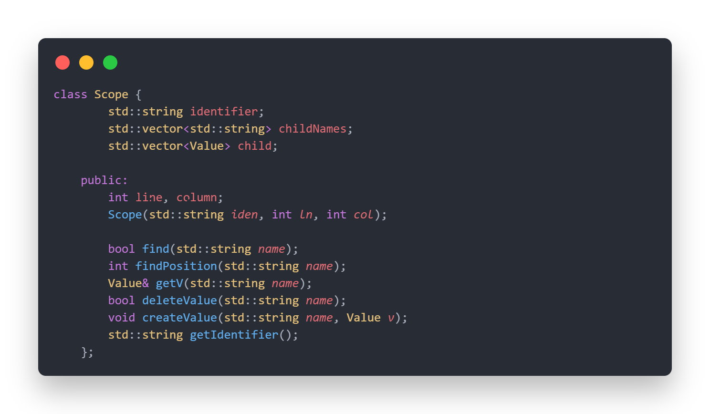
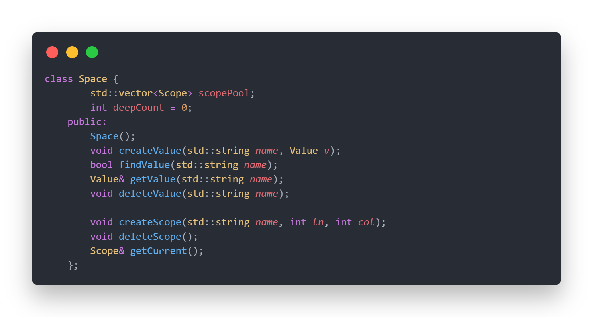
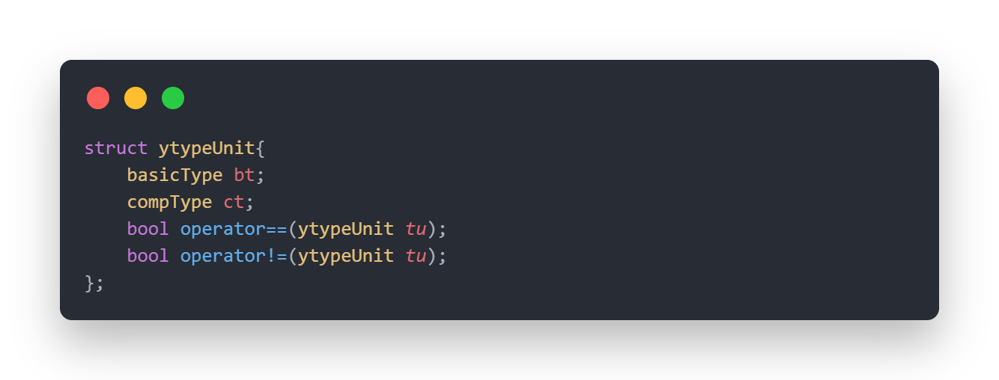
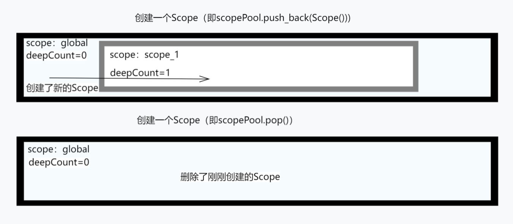

### [返回到目录](content.md)
## 第四章：作用域
在这个章节中，您将清晰地知道Yolang中的作用域以及它是怎么工作的\
\
在Yolang中，有作用域的概念，但是在这之前，我们将以源码来分析一下Yolang的Value，Scope和Space系统\
如下：
\
\

如上三图，我们将从Value开始分析\
可以从图一清晰地看出Value的实现：以多个类型的值为基础，后面跟上的是三个不同复合类型的值：ref，list（在list-like-struct类型时与list共用）与struct；同时每个Value的存储是以图中的typeUnit进行存储，这是一个结构体，定义如下：

可以看出一个typeUnit由basicType（基础类型）和compType（复合类型）组成\
\
下面来看图二，这个就是在Yolang中Scope的设计实现，是由多个Value组成的`std::vector`，同时在外部还有一个类型为`std::vector<std::string>`的标识符表，这个东西是从当前scope中获得对应的Value的必要的东西，当然，如果你对一个标识符使用了delete，那么标识符及其对应的Value都会被一同删除\
\
图三是Yolang中Space的实现，Space是由多个Scope组成的结构，每一个Space都必定有一个名为“global”的Scope（当然在Yolang中，一般只有一个Space）；deepCount则是控制当前Scope的深度，当有一个新的Scope被创建，deepCount会自增1，当有一个Scope被删除（只能删除位于`scopePool[scopePool.size() - 1]`的scope）deepCount会自减1，如下示意图可以很好的说明它的工作原理：
\
\
\
下面，我们将讲一下Yolang中的作用域\
在Yolang中，作用域即每一个Scope，一般地，当有n个Scope（n>=2）且这些Scope都层层嵌套，我们把最外层的那个Scope成为根Scope（根scope没有父scope）；而在这个过程中，除根scope外所有嵌套的Scope，那个在外部的Scope成为被包含的Scope（这个“被包含的Scope”的数量不定，可以是1，也可以是多个）的父Scope，被包含在内的则成为子scope。如您所见，global就是一个根Scope；也是所有Scope的父Scope。如下示意图可以很好的阐述上面的内容：

如上图，global是scope-1，scope-2的根scope，也可以说是scope-1，scope-2的父scope，但是scope-1是global的子scope，scope-2则是scope-1的唯一子scope，也就是说，存在如下关系：
```
scope-2 ⊊ scope-1 ⊊ global
```
由上面的关系，我们可以推断：在global中的Value就必定在其所有子scope中，同样，如果存在scope-1，scope-2，满足关系`scope-2 ⊊ scope-1`，则存在于scope-1中的Value也必定存在于scope-2；这意味着在子scope使用所有父scope（一个子scope不一定只有一个父scope，但是一个根scope是没有父scope的！）中存在的内容是合法正确的